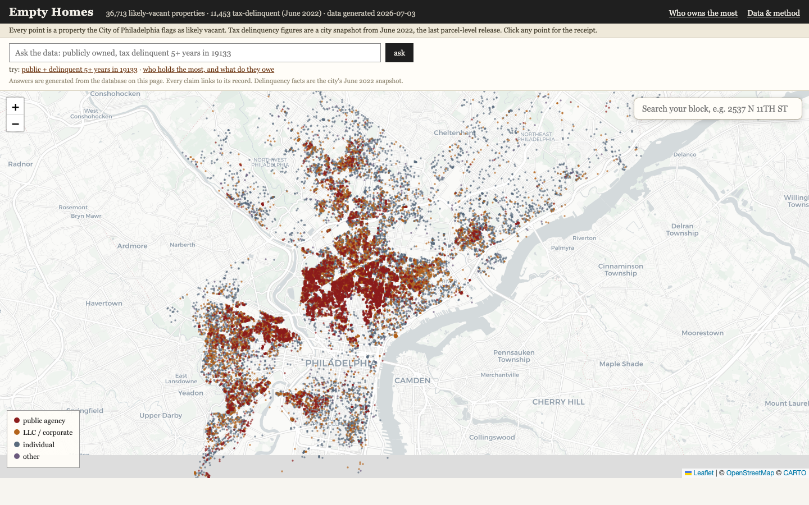
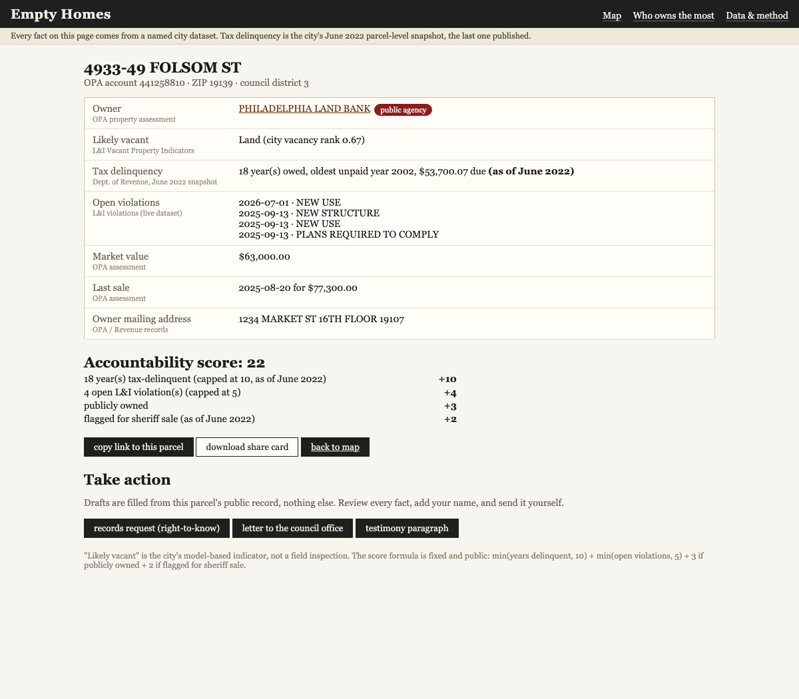
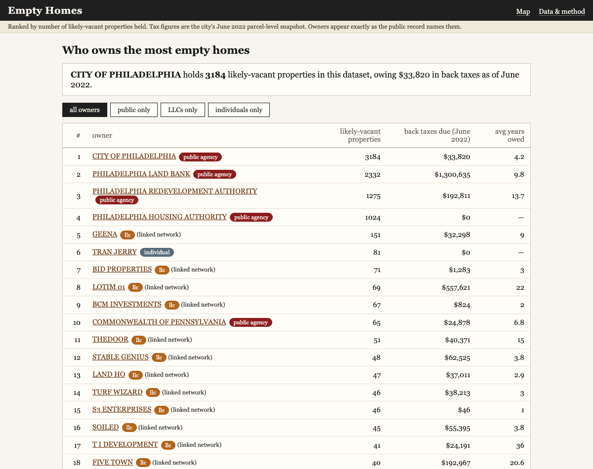

# Empty Homes

A public map of every likely-vacant property in Philadelphia: who owns it, how long it has sat empty and tax-delinquent, and a way for anyone to pull the receipts on a house, a block, or the landlord holding the most.

**Live demo: [lllove514.github.io/empty-homes](https://lllove514.github.io/empty-homes/)** (map, block search, parcel receipts, leaderboard, open-data downloads, and the grounded ask-the-data layer, rebuilt weekly from the city's APIs; letter drafts run in the local install)



## What the data shows (July 2026 build)

The city's own records, joined for the first time in one place:

| | |
|---|---|
| Likely-vacant properties citywide | **36,713** |
| Held by public agencies | **7,947** (City of Philadelphia 3,184 · Land Bank 2,332 · Redevelopment Authority 1,275 · Housing Authority 1,024) |
| Tax-delinquent (as of June 2022, the city's last parcel-level release) | **11,453 properties, $86.6M owed** |
| Longest-running delinquency | **45 years** |
| Open L&I violations on vacant parcels | **34,418** |
| Largest shell network found by entity resolution | **32 LLCs sharing one Center City mailing address, holding 409 vacant parcels** |

Built with and for [Poor People's Army](https://www.poorpeoplesarmy.org/) (PPEHRC), the Philadelphia housing-rights movement whose core argument is exactly this: homes sit empty while people sleep outside. The facts were always public. They just lived in four city datasets that do not talk to each other.

## What it does

**Search your block.** Type an address, see every likely-vacant property around it and who owns it. Every parcel page is a receipt: owner, years delinquent, open violations, market value, each fact labeled with its source dataset, plus a transparent accountability score anyone can recompute.



**Who owns the most.** A ranked leaderboard of owners, public agencies and private landlords both. Owner names are entity-resolved: agency name variants merge through a hand-curated alias list, and LLCs sharing a mailing address are linked as a network. That is how 32 differently-named LLCs (Land Ho, Turf Wizard, Plotz, Stable Genius, Lots and Found...) turned out to be one operation at 25 S 19th St.



**Ask the data.** A grounded Claude layer answers plain-language questions ("publicly owned, tax delinquent 5+ years in 19133"). The model can only speak through three read-only database tools, must cite every claim as `[opa:...]` or `[owner:...]`, and the server verifies every citation against that request's actual tool results before releasing the answer. Unverifiable citation, no answer. No citations at all, no answer either, so the model can't be talked into general chat: text that isn't anchored to the database never leaves the server. The model cannot invent a property. On the live demo this runs as a Cloudflare Worker with the database in D1 (see `worker/`), same rules, rate-limited and capped so it stays a data tool and nothing else.

**Take action.** One click drafts a Pennsylvania Right-to-Know request, a council office letter, or a testimony paragraph, filled from the parcel's record by plain template substitution. No model in that path on purpose: an artifact a person signs and sends should contain nothing a model could get wrong.

**Open data.** The cleaned, joined dataset downloads as CSV and SQLite from the Data page, method documented, so journalists and researchers can build on it.

## Quickstart

Python 3.10+. No packages to install; the pipeline is standard library only.

```
python3 pipeline/run_all.py     # fetch all four city datasets, build, verify (a few minutes)
python3 server/app.py           # serve at http://localhost:8080  (PORT=8090 to change)
```

For the AI layer, put a key in `.env` at the repo root: `ANTHROPIC_API_KEY=sk-...`. Everything else works without it.

Every pipeline stage has a `--check` mode that validates its output against the source, and `pipeline/check_db.py --live` re-fetches random parcels from the city's API and compares them to the built database to the cent. `server/test_grounding.py` and `worker/test_grounding.mjs` prove the citation verifier fails closed, offline, in both implementations.

To deploy the ask layer for the public demo (Cloudflare Worker + D1, free tier), see `worker/README.md`.

## Data sources

All public, all City of Philadelphia, via OpenDataPhilly: Vacant Property Indicators (L&I, the parcel spine), Properties and Assessment History (OPA), Real Estate Tax Delinquencies (Revenue), and open L&I Violations. Parcels join on the OPA account number.

## The score

Fixed, public, recomputable by anyone from the parcel page:

```
score = min(years tax-delinquent, 10)
      + min(open L&I violations, 5)
      + 3 if publicly owned
      + 2 if flagged for sheriff sale
```

Public ownership scores points because a public agency holding housing vacant carries a public duty a private owner does not.

## Known limitations

- The city stopped publishing parcel-level tax delinquency in June 2022. Every delinquency fact is that snapshot and is labeled so wherever it appears.
- "Likely vacant" is the city's model-based indicator, not a field inspection. This project inherits its false positives and says "likely-vacant", never "abandoned".
- A shared mailing address links owners as a network. That is a documented fact, not proof of common control, and the UI says so.
- Owners appear exactly as the public record names them. Nothing is enriched beyond what the city publishes.

## Boundary

This is an accountability tool built entirely on public records, for lawful pressure: reporting, organizing, testimony, records requests, litigation. It does not rank or select properties for entry or occupation, and the ask endpoint refuses that shape of question.

## Taking it to another city

Swap the four fetchers in `pipeline/` for your city's parcel, vacancy, delinquency, and violations datasets, keep the parcel-id join key, and edit `pipeline/agencies.json` for your local public agencies. Everything downstream is city-agnostic.
